# Criar uma Máquina Virtual no Azure

## Criar uma Máquina virtual

Na página inicial do Azure, pesquise “Máquinas Virtuais” na barra de pesquisa na parte superior.
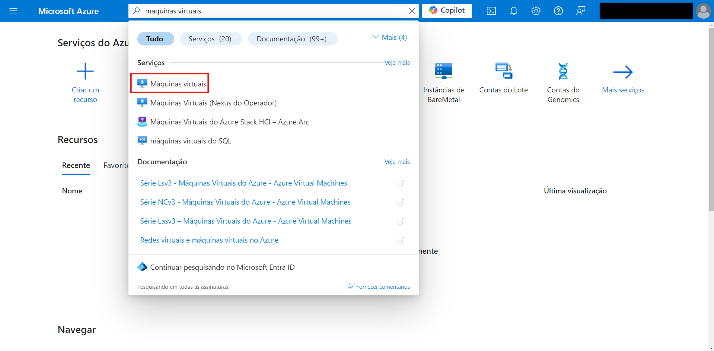

Na página Máquinas virtuais, clique no botão “Criar” e selecione “Máquina virtual do Azure”.
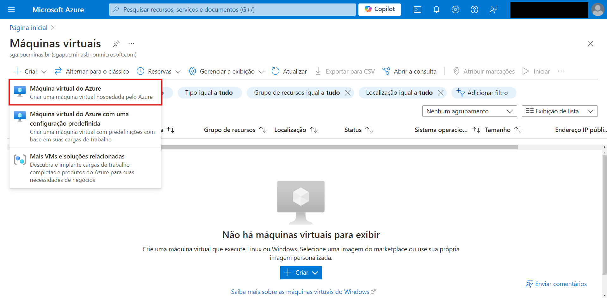

## Configuração

### Básico

- Assinatura: Escolha sua assinatura do Azure.
- Grupo de recursos: Selecione um grupo de recursos existente ou crie um novo.

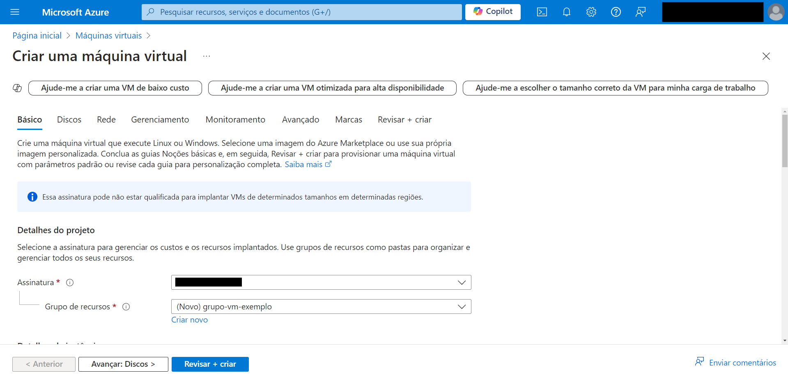

- Nome da máquina virtual: Insira um nome para sua VM.
- Região: Escolha a localização do data center (por exemplo, East US, West Europe, etc.).
- Opções de disponibilidade: Selecione um conjunto de disponibilidade, uma zona ou nenhuma (com base nas suas necessidades de redundância e disponibilidade).
- Imagem: Selecione o SO para sua VM (por exemplo, Windows Server, Ubuntu, Red Hat, etc.).
- Tamanho: Escolha o tamanho da VM (com base nas suas necessidades de CPU, RAM e desempenho).

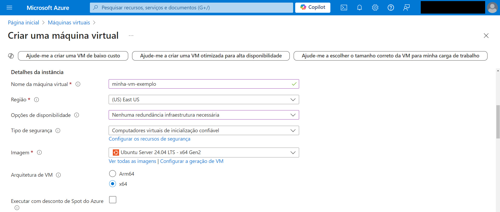
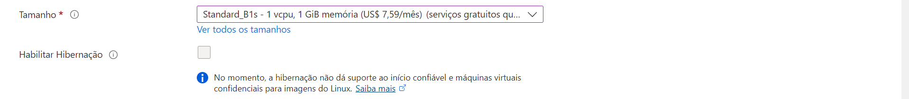

- Conta de administrador: Digite um nome de usuário e defina uma senha, ou chave pública SSH se estiver usando Linux.

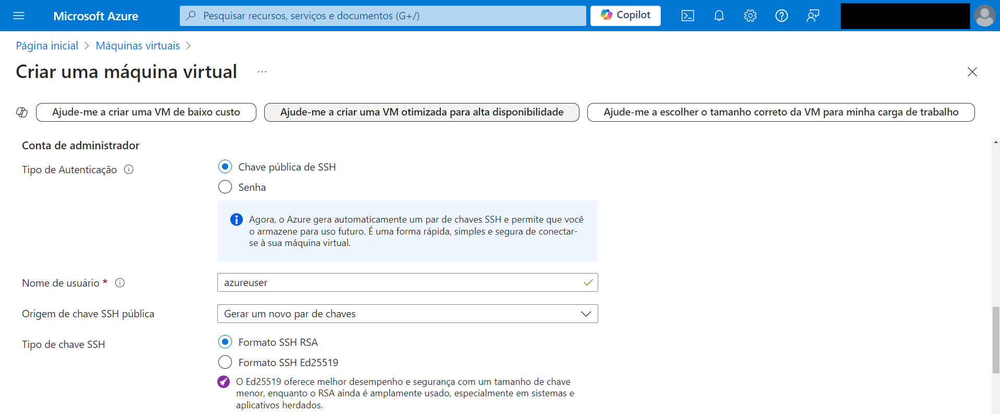
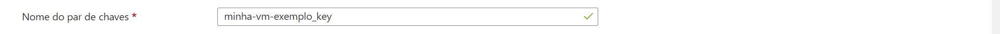

### Discos

- Tipo de disco de SO: Escolha o tipo de disco do SO de sua preferência (HDD padrão, SSD padrão, SSD premium).

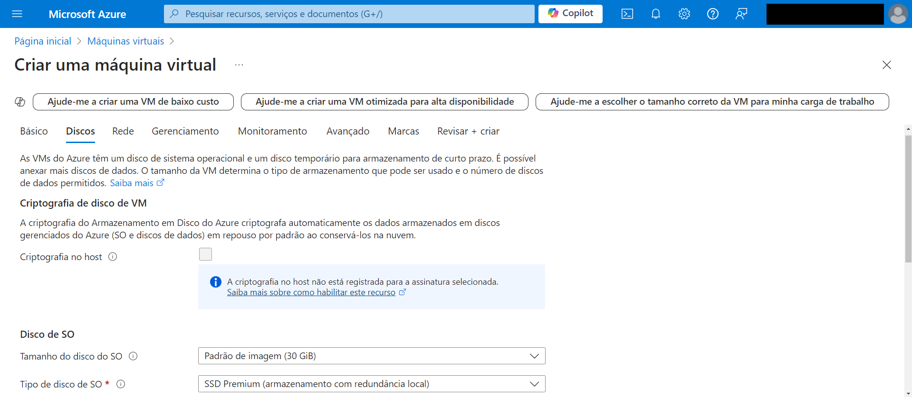
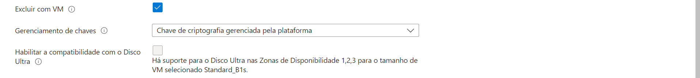

- Discos de dados: Adicione quaisquer discos de dados adicionais, se necessário.

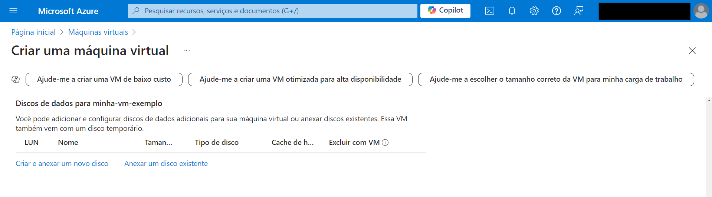

### Rede

- Redes virtuais (VNet): Selecione uma rede virtual existente ou crie uma nova.
- Sub-rede: Escolha ou crie uma sub-rede para sua VM.
- IP público: decida se deseja que sua VM tenha um endereço IP público.
- Grupo de segurança de rede do adaptador de rede (NSG): Escolha um NSG (firewall) para controlar o tráfego de e para a VM (você pode criar um novo ou selecionar um existente).
- Portas de entrada públicas: Permita portas específicas (por exemplo, HTTP, HTTPS, RDP, SSH) com base no seu caso de uso.

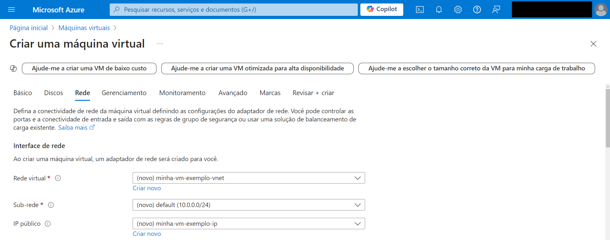
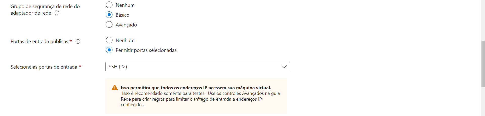
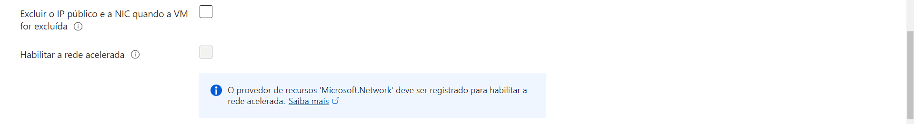

### Gerenciamento

- Identidade: Configure identidades gerenciadas atribuídas pelo sistema ou pelo usuário para a VM (se necessário).
- Desligamento automático: Configure um horário de desligamento automático se quiser desligar automaticamente a VM em um determinado horário todos os dias.
- Backup: Habilite o backup se quiser que o Azure faça backup automaticamente da VM.
- Atualizações do SO convidado: Configure como os patches serão aplicados à VM.

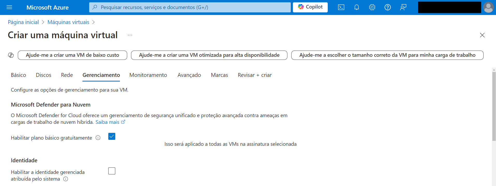
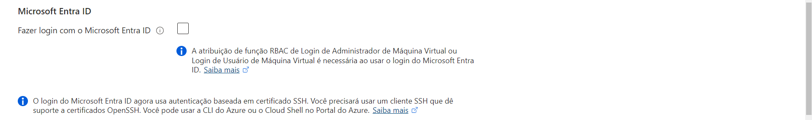
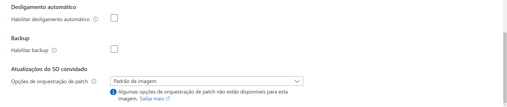

### Monitoramento

- Ative ou desative o diagnóstico de inicialização, o diagnóstico de convidado do SO, etc. conforme necessário.

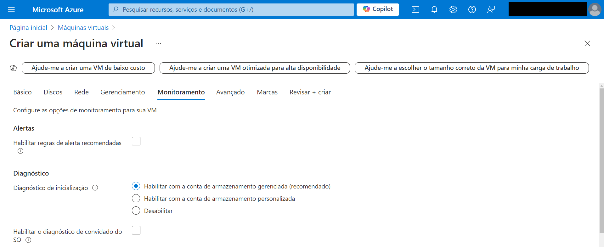
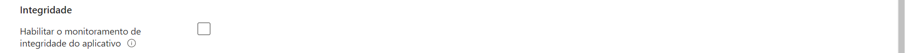

### Revisar + Criar

- Verifique seus custos e todas as suas configurações que você fez.
- Clique em "Criar". O Azure validará a sua configuração e, em seguida, iniciará a implantação da VM.

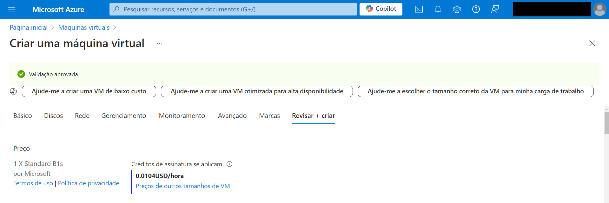
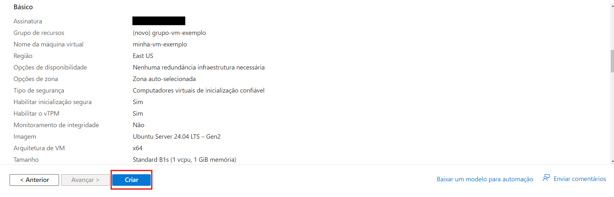
